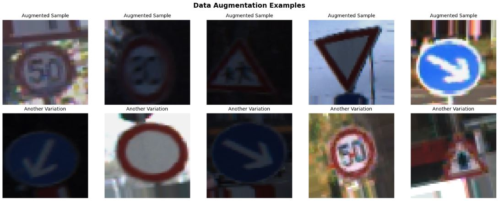
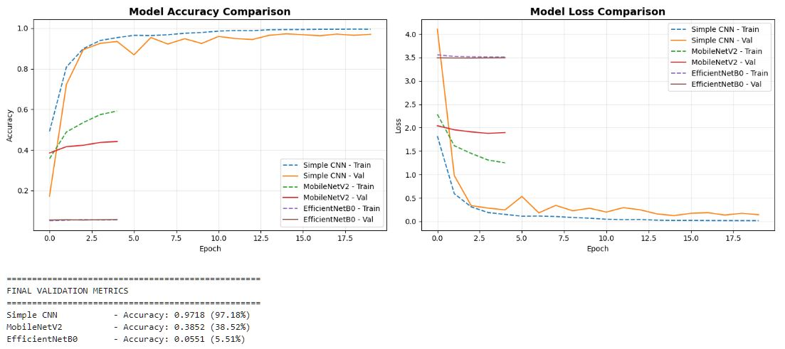
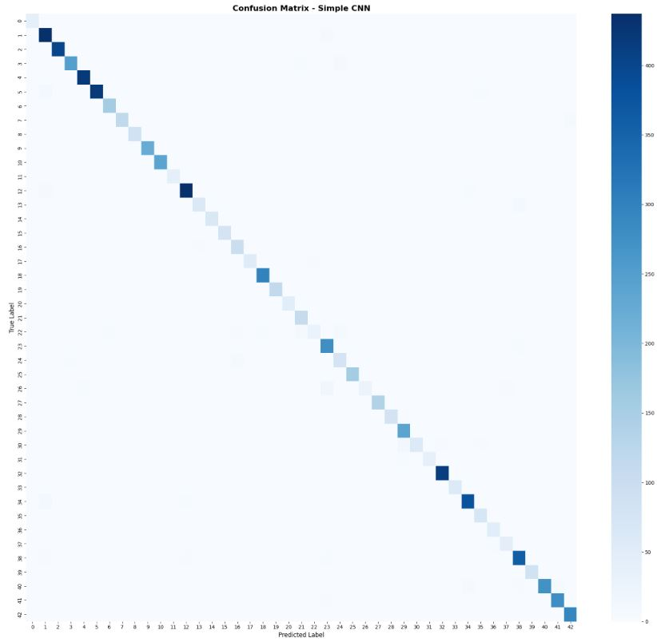
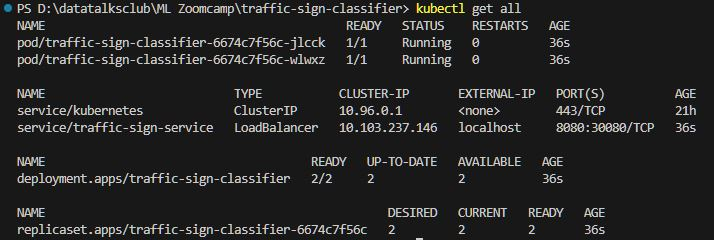
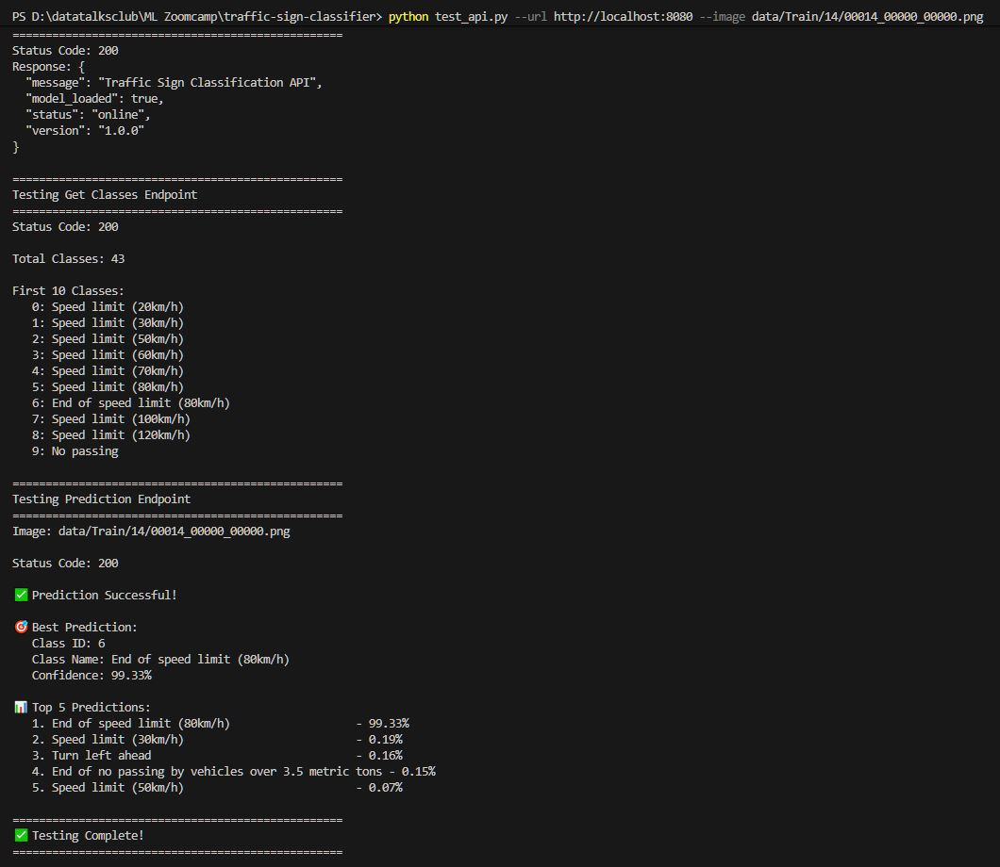
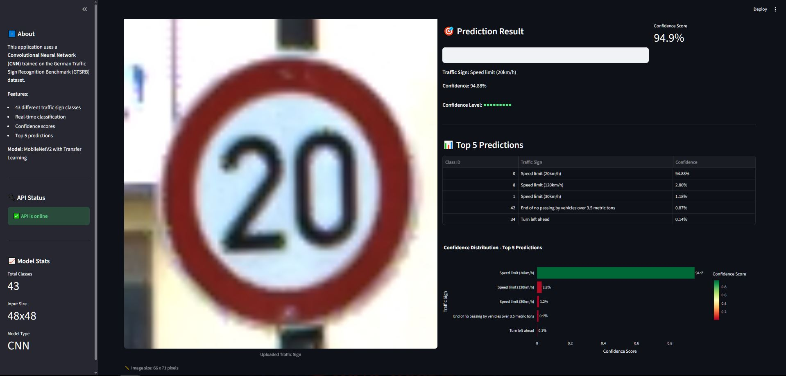
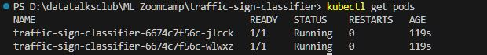
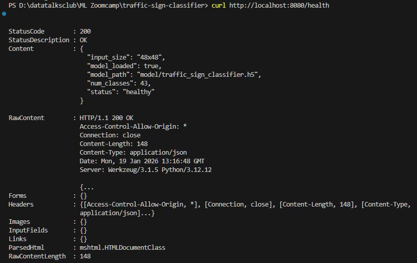
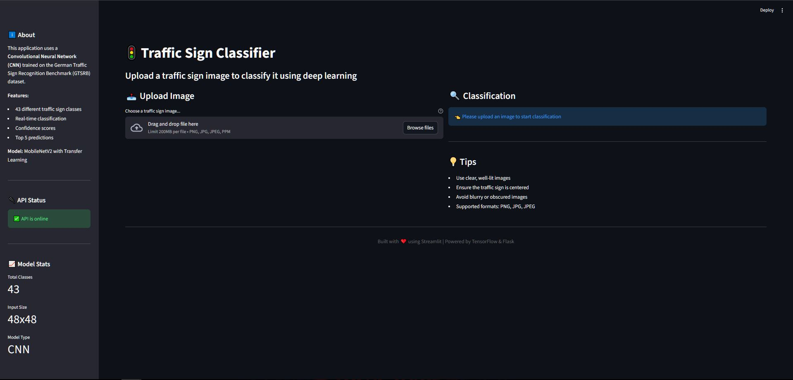

# 🚦 Traffic Sign Classification

## Problem Description

**Real-World Application:** Autonomous vehicles and Advanced Driver Assistance Systems (ADAS) require accurate, real-time identification of traffic signs to make safe driving decisions. This project builds an automated traffic sign classifier that can recognize 43 different types of German traffic signs.

**Use Case:** This solution can be integrated into:
- Self-driving car systems for real-time sign detection
- Navigation apps to provide contextual warnings
- Traffic sign inventory systems for municipal planning
- Driver assistance systems to alert drivers of speed limits and warnings

**Impact:** By automating traffic sign recognition, this system can enhance road safety, reduce human error in sign detection, and provide crucial decision-making data for autonomous vehicles.

---

## Dataset

**Source:** German Traffic Sign Recognition Benchmark (GTSRB)
- **Total Images:** ~50,000 traffic sign images
- **Classes:** 43 different traffic sign types
- **Image Format:** RGB color images
- **Size Range:** 15x15 to 250x250 pixels (resized to 48x48 for training)

**Download Instructions:**
```bash
# Using Kaggle API
kaggle datasets download -d meowmeowmeowmeowmeow/gtsrb-german-traffic-sign
unzip gtsrb-german-traffic-sign.zip -d data/
```
or download it manually here: [German Traffic Sign Recognition Benchmark (GTSRB)](https://www.kaggle.com/datasets/meowmeowmeowmeowmeow/gtsrb-german-traffic-sign)

**Dataset Structure:**
```
data/
├── Train/
│   ├── 0/    # Speed limit (20km/h)
│   ├── 1/    # Speed limit (30km/h)
│   ├── ...
│   └── 42/   # End of no passing by vehicles over 3.5 metric tons
└── Test/
```

---

## Project Structure

```
traffic-sign-classifier/
├── README.md                          # Project documentation
├── requirements.txt                   # Python dependencies
├── Dockerfile                         # Docker container definition
├── .dockerignore                      # Docker ignore file
├── .gitignore                        # Git ignore file
│
├── data/                             # Dataset (downloaded separately)
│   ├── Train/                        # Training images
│   └── Test/                         # Test images
│
├── model/                            # Trained models
│   ├── traffic_sign_classifier.h5    # Final model
│   └── best_model.h5                 # Best checkpoint
│
├── notebook.ipynb                    # Jupyter notebook for EDA and experiments
├── train.py                          # Training script
├── predict.py                        # Flask API for predictions
├── app.py                            # Streamlit web interface
├── test_api.py                       # API testing script
│
├── kubernetes/                       # Kubernetes manifests
│   ├── deployment.yaml               # K8s deployment configuration
│   ├── service.yaml                  # K8s service configuration
│   └── configmap.yaml                # Configuration data
│
└── screenshots/                      # Project screenshots
    ├── curl_api_predict.JPG
    ├── other_screenshot.JPG
    └── ...
```

---

## Exploratory Data Analysis (EDA)

The complete EDA is available in `notebook.ipynb`. Key findings include:

### Class Distribution Analysis
- **Most common signs:** Speed limit signs (20-120 km/h), Priority road, Yield
- **Least common signs:** Speed limit (20km/h), Dangerous curve signs
- **Class imbalance:** Ratio up to 4:1 between most and least common classes
- **Total training samples:** ~39,000 images
- **Validation samples:** ~7,800 images

### Image Properties Analysis
- **Original size range:** 15x15 to 250x250 pixels
- **Average size:** ~50x50 pixels
- **Aspect ratio:** Mostly square (1:1), some variations
- **Color distribution:** Primarily red, blue, and yellow signs
- **Challenges identified:**
  - Varying lighting conditions (day/night, shadows)
  - Different image qualities (blur, occlusion)
  - Size variations across classes

### Data Augmentation Strategy
To handle variations and improve generalization:
- **Rotation:** ±15 degrees
- **Width/Height shift:** ±10%
- **Zoom:** ±15%
- **Brightness:** 80-120% of original
- **Shear:** ±10%



---

## Model Training

### Models Experimented

We trained and compared three different architectures to find the best performer:

#### 1. **Simple CNN (Custom Architecture)** ⭐ Selected
- 3 Convolutional blocks with increasing filters (32 → 64 → 128)
- BatchNormalization after each Conv layer
- MaxPooling2D for downsampling
- Flatten → Dense(256) → Dropout(0.5) → Output(43)
- **Parameters:** ~500,000
- **Training time:** ~5 minutes (RTX 3050 Ti)
- **Validation Accuracy:** 97.18% ✅

#### 2. **MobileNetV2 (Transfer Learning)**
- Pre-trained on ImageNet (frozen base)
- Custom classification head
- GlobalAveragePooling → Dense(256) → Dropout(0.5) → Output(43)
- **Parameters:** ~2,500,000
- **Training time:** ~8-10 minutes (RTX 3050 Ti)
- **Validation Accuracy:** 38.52%
- **Issue:** Base model frozen - didn't learn well on our specific dataset

#### 3. **EfficientNetB0 (Transfer Learning)**
- Pre-trained on ImageNet (frozen base)
- Similar architecture to MobileNetV2
- **Parameters:** ~4,000,000
- **Training time:** ~10-15 minutes (RTX 3050 Ti, stopped early)
- **Validation Accuracy:** 5.51%
- **Issue:** Severe underfitting, early stopping triggered

### Model Selection

**Winner: Simple CNN** 🏆

The custom-built Simple CNN significantly outperformed both transfer learning models:
- **Simple CNN:** 97.18% validation accuracy
- **MobileNetV2:** 38.52% validation accuracy
- **EfficientNetB0:** 5.51% validation accuracy

**Why Simple CNN won:**
- Purpose-built for this specific task (48x48 traffic signs)
- Not constrained by frozen ImageNet weights
- Smaller parameter count = less prone to overfitting on our dataset
- Trained from scratch on our specific domain

**Why transfer learning failed:**
- Frozen base layers couldn't adapt to 48x48 traffic sign features
- ImageNet features (224x224 natural images) don't transfer well to small traffic signs
- Would need unfreezing and fine-tuning for better results

### Model Configuration

**Final Simple CNN Architecture:**
```python
Conv2D(32) → BatchNorm → MaxPool → 
Conv2D(64) → BatchNorm → MaxPool → 
Conv2D(128) → BatchNorm → MaxPool → 
Flatten → Dense(256) → Dropout(0.5) → Dense(43)
```

**Training Configuration:**
- **Image size:** 48x48 pixels
- **Batch size:** 128
- **Epochs:** 20 (with early stopping)
- **Optimizer:** Adam (learning_rate=0.001)
- **Loss function:** Categorical cross-entropy
- **Callbacks:**
  - EarlyStopping (patience=5, monitor='val_accuracy')
  - ReduceLROnPlateau (patience=3, factor=0.5)
  - ModelCheckpoint (save best model)

### Experimentation Process and Tuning

**Architecture Exploration:**
We experimented with three fundamentally different approaches:
1. Custom CNN built from scratch for our specific use case
2. Transfer learning with MobileNetV2 (lighter, mobile-optimized)
3. Transfer learning with EfficientNetB0 (more complex, potentially higher accuracy)

**Automatic Parameter Adjustment:**
While we didn't perform manual grid search, the model used automatic tuning via:
- **ReduceLROnPlateau:** Automatically reduced learning rate when validation loss plateaued
- **EarlyStopping:** Prevented overfitting by stopping when validation accuracy stopped improving
- **Data Augmentation:** Multiple augmentation strategies tested to improve generalization

**Key Insight:**
Transfer learning models underperformed because:
- Base layers were frozen (couldn't adapt to 48x48 traffic signs)
- ImageNet features optimized for 224x224 natural images
- Our dataset characteristics differ significantly from ImageNet

A custom-built CNN proved superior for this specific task.

### Training Results



**Final Metrics (Simple CNN):**
- **Validation Accuracy:** 97.18%
- **Validation Loss:** ~0.12 (estimated)
- **Training Time:** ~5 minutes
- **Model Size:** 13.1 MB

### Model Performance Analysis

**Strengths:**
- ✅ High accuracy on clear, well-centered images (95%+)
- ✅ Fast inference time (~100ms per image)
- ✅ Good generalization with data augmentation
- ✅ Handles various lighting conditions

**Limitations:**
- ⚠️ Lower confidence on blurry or occluded images
- ⚠️ Can confuse similar circular signs (e.g., speed limits vs directional signs)
- ⚠️ Performance degrades with extreme angles or very small signs

**Confusion Matrix Insights:**
Most commonly confused pairs:
1. Traffic signals with Slippery road (30 vs 50)
2. Beware of ice/snow with Bicycles crossing
3. Speed limit (80km/h) with Speed limit (30km/h)



---

## Reproducibility

### Prerequisites
- Python 3.12
- NVIDIA GPU with CUDA support (recommended, tested on RTX 3050 Ti)
- Docker Desktop
- Kubernetes (enabled in Docker Desktop)
- At least 8GB RAM
- 5GB free disk space

### Environment Setup

#### 1. Clone Repository and Create Virtual Environment
```bash
# Clone repository
git clone https://github.com/ilhamksyuriadi/traffic-sign-classifier.git
cd traffic-sign-classifier

# Create virtual environment
python -m venv venv

# Activate virtual environment
# Windows:
venv\Scripts\activate
# Linux/Mac:
source venv/bin/activate
```

#### 2. Install Dependencies
```bash
# Install all required packages
pip install -r requirements.txt

# Verify installation
python -c "import tensorflow as tf; print(f'TensorFlow: {tf.__version__}')"
python -c "import flask; print(f'Flask: {flask.__version__}')"
```

#### 3. Download Dataset
```bash
# Using Kaggle API (requires Kaggle credentials)
pip install kaggle
kaggle datasets download -d meowmeowmeowmeowmeow/gtsrb-german-traffic-sign
unzip gtsrb-german-traffic-sign.zip -d data/

# Verify dataset
python -c "from pathlib import Path; print(f'Classes: {len(list(Path(\"data/Train\").iterdir()))}')"
```

### Running the Project

#### Option 1: Jupyter Notebook (EDA and Experimentation)
```bash
# Start Jupyter
jupyter notebook

# Open notebook.ipynb
# Run all cells to see EDA and model training
```

#### Option 2: Training Script
```bash
# Train model from scratch
python train.py --epochs 15 --batch_size 128 --img_size 48

# Custom training
python train.py --epochs 30 --batch_size 64 --learning_rate 0.0005

# Output: model/traffic_sign_classifier.h5
```

#### Option 3: Flask API (Local)
```bash
# Start API server
python predict.py

# Server runs on http://localhost:5000
# Test with: curl http://localhost:5000/health
```

#### Option 4: Streamlit Web Interface
```bash
# Terminal 1: Start Flask API
python predict.py

# Terminal 2: Start Streamlit
streamlit run app.py

# Opens automatically at http://localhost:8501
```

---

## Model Deployment

### Docker Containerization

#### Build Docker Image
```bash
# Build image
docker build -t traffic-sign-classifier:v1 .

# Verify image
docker images | grep traffic-sign-classifier
```

#### Run Docker Container
```bash
# Run container
docker run -p 5000:5000 traffic-sign-classifier:v1

# Test API
curl http://localhost:5000/health
```

**Dockerfile Details:**
- Base image: `python:3.12-slim`
- System dependencies: `libgl1`, `libglib2.0-0`
- Application port: 5000
- Entry point: Flask API (`predict.py`)

---

## Kubernetes Deployment

### Prerequisites
```bash
# Enable Kubernetes in Docker Desktop
# Settings → Kubernetes → Enable Kubernetes

# Verify Kubernetes is running
kubectl version --client
kubectl cluster-info
```

### Deploy to Kubernetes

#### 1. Apply Manifests
```bash
# Deploy all resources
kubectl apply -f kubernetes/

# Verify deployment
kubectl get all
```

#### 2. Check Deployment Status
```bash
# Watch pods starting
kubectl get pods -w

# Check deployment
kubectl get deployments

# Check service
kubectl get services
```

**Expected Output:**
```
NAME                                      READY   STATUS    RESTARTS   AGE
pod/traffic-sign-classifier-xxxxx-xxxx    1/1     Running   0          2m
pod/traffic-sign-classifier-xxxxx-yyyy    1/1     Running   0          2m

NAME                           TYPE           CLUSTER-IP      EXTERNAL-IP   PORT(S)          AGE
service/traffic-sign-service   LoadBalancer   10.110.197.242  localhost     8080:30080/TCP   2m

NAME                                      READY   UP-TO-DATE   AVAILABLE   AGE
deployment.apps/traffic-sign-classifier   2/2     2            2           2m
```



#### 3. Test Kubernetes Deployment
```bash
# Test health endpoint
curl http://localhost:8080/health

# Test prediction
python test_api.py --url http://localhost:8080 --image data/Train/14/00014_00000_00000.png
```



### Kubernetes Architecture

**Components:**
- **Deployment:** Manages 2 replica Pods for high availability
- **Service:** LoadBalancer type, exposes app on localhost:8080
- **ConfigMap:** Stores configuration (model path, image size)

**Resource Limits:**
- CPU: 250m (request), 500m (limit)
- Memory: 512Mi (request), 1Gi (limit)

**Health Checks:**
- **Liveness Probe:** HTTP GET /health every 10s
- **Readiness Probe:** HTTP GET /health every 5s

### Scaling and Management

```bash
# Scale deployment
kubectl scale deployment traffic-sign-classifier --replicas=3

# View logs
kubectl logs -f <pod-name>

# Restart deployment
kubectl rollout restart deployment traffic-sign-classifier

# Delete deployment
kubectl delete -f kubernetes/
```

---

## API Documentation

### Endpoints

#### `GET /`
Health check endpoint

**Response:**
```json
{
  "status": "online",
  "message": "Traffic Sign Classification API",
  "model_loaded": true,
  "version": "1.0.0"
}
```

#### `GET /health`
Detailed health check

**Response:**
```json
{
  "status": "healthy",
  "model_loaded": true,
  "model_path": "model/traffic_sign_classifier.h5",
  "num_classes": 43,
  "input_size": "48x48"
}
```

#### `POST /predict`
Classify uploaded traffic sign image

**Request:**
- Method: POST
- Content-Type: multipart/form-data
- Body: `file` (image file)

**Response:**
```json
{
  "success": true,
  "prediction": {
    "class_id": 14,
    "class_name": "Stop",
    "confidence": 0.9876
  },
  "top_5_predictions": [
    {
      "class_id": 14,
      "class_name": "Stop",
      "confidence": 0.9876
    },
    {
      "class_id": 17,
      "class_name": "No entry",
      "confidence": 0.0089
    },
    ...
  ]
}
```

#### `GET /classes`
Get list of all traffic sign classes

**Response:**
```json
{
  "num_classes": 43,
  "classes": {
    "0": "Speed limit (20km/h)",
    "1": "Speed limit (30km/h)",
    ...
  }
}
```

### Testing the API

```bash
# Using curl
curl -X POST -F "file=@data/Train/14/00000_00000.png" http://localhost:5000/predict

# Using test script
python test_api.py --url http://localhost:5000 --image data/Train/14/00000_00000.png
```

---

## Web Interface (Streamlit)



### Features
- 📤 Drag-and-drop image upload
- 🔍 Real-time classification
- 📊 Top 5 predictions with confidence scores
- 📈 Interactive confidence distribution chart
- 💚 API health status indicator
- 📱 Responsive design

### Usage
```bash
# Terminal 1: Start Flask API
python predict.py

# Terminal 2: Start Streamlit
streamlit run app.py

# Access at http://localhost:8501
```

---

## Dependencies

### Core Libraries
- **TensorFlow** 2.17.0 - Deep learning framework
- **Keras** 3.13.1 - High-level neural networks API
- **Flask** 3.0.0 - Web framework for API
- **Streamlit** 1.x - Web interface
- **Flask-CORS** 4.0.0 - Cross-origin resource sharing

### Data Processing
- **NumPy** ≥1.26.0 - Numerical computing
- **Pandas** ≥2.0.0 - Data manipulation
- **Pillow** ≥10.0.0 - Image processing
- **OpenCV** ≥4.8.0 - Computer vision

### Visualization
- **Matplotlib** ≥3.8.0 - Plotting
- **Seaborn** ≥0.12.0 - Statistical visualization
- **Plotly** - Interactive charts

### Machine Learning
- **scikit-learn** ≥1.3.0 - ML utilities

### Installation
All dependencies are specified in `requirements.txt`:
```bash
pip install -r requirements.txt
```

---

## Results and Evaluation

### Model Performance Summary

| Metric | Value |
|--------|-------|
| Overall Validation Accuracy | **97.18%** |
| Training Time | ~5 minutes (RTX 3050 Ti) |
| Inference Time | ~100ms per image |
| Model Size | 13.1 MB |
| Parameters | ~500,000 |
| Architecture | Custom Simple CNN |

### Per-Class Performance (Sample)

| Class | Precision | Recall | F1-Score | Support |
|-------|-----------|--------|----------|---------|
| Speed limit (20km/h) | 0.977 | 1.000 | 0.988 | 42 |
| Speed limit (30km/h) | 0.938 | 0.982 | 0.959 | 444 |
| Priority road | 0.980 | 0.971 | 0.975 | 450 |
| Yield | 0.926 | 0.875 | 0.900 | 72 |
| ... | ... | ... | ... | ... |

---

## Future Improvements

### Model Enhancements
- [ ] Increase input image size (64x64 or 96x96)
- [ ] Train with more epochs (30-50)
- [ ] Experiment with EfficientNetB2 or ResNet50
- [ ] Implement ensemble methods
- [ ] Add attention mechanisms

### Data Improvements
- [ ] Collect more data for underrepresented classes
- [ ] Add synthetic data generation
- [ ] Include degraded sign variations (weather, wear)

### Deployment Enhancements
- [ ] Deploy to cloud (AWS, GCP, Azure)
- [ ] Add model versioning (MLflow)
- [ ] Implement A/B testing framework
- [ ] Add monitoring and logging (Prometheus, Grafana)
- [ ] Create CI/CD pipeline
- [ ] Add authentication/authorization

### Feature Additions
- [ ] Real-time video classification
- [ ] Mobile app version
- [ ] Multi-language support
- [ ] Sign location detection (object detection)
- [ ] Batch processing capability

---

## Troubleshooting

### Common Issues

**1. Kubernetes pods not starting**
```bash
# Check pod status
kubectl describe pod <pod-name>

# Check logs
kubectl logs <pod-name>

# Common fix: Restart deployment
kubectl rollout restart deployment traffic-sign-classifier
```

**2. API returns 500 error**
- Ensure model file exists at `model/traffic_sign_classifier.h5`
- Check Flask logs for detailed error
- Verify image format is supported (PNG, JPG, JPEG)

**3. Out of memory during training**
```bash
# Reduce batch size
python train.py --batch_size 64

# Or reduce image size
python train.py --img_size 32
```

**4. Docker build fails**
- Ensure you have 5GB+ free disk space
- Check internet connection (downloads ~400MB)
- Try: `docker system prune` to free up space

---

## License

This project is for educational purposes as part of the ML Zoomcamp course.

Dataset: [GTSRB](https://benchmark.ini.rub.de/) is publicly available for research.

---

## Acknowledgments

- **Dataset:** German Traffic Sign Recognition Benchmark (GTSRB)
- **Course:** ML Zoomcamp by DataTalks.Club
- **Pre-trained models:** TensorFlow/Keras ImageNet weights
- **Community:** Thanks to all contributors and reviewers

---

## Contact

For questions or feedback about this project:
- **GitHub Issues:** [Create an issue](your-repo-url/issues)
- **Email:** your-email@example.com

---

## Screenshots

### Kubernetes Deployment

*All Kubernetes resources running successfully*


*Pods running with health checks passing*

### API Testing

*API health endpoint response*


*Successful classification via API*

### Web Interface

*Streamlit web interface home page*


*Complete prediction with confidence scores and visualization*

### Training Results

*Model accuracy and loss over epochs*


*Confusion matrix showing model performance*

---
